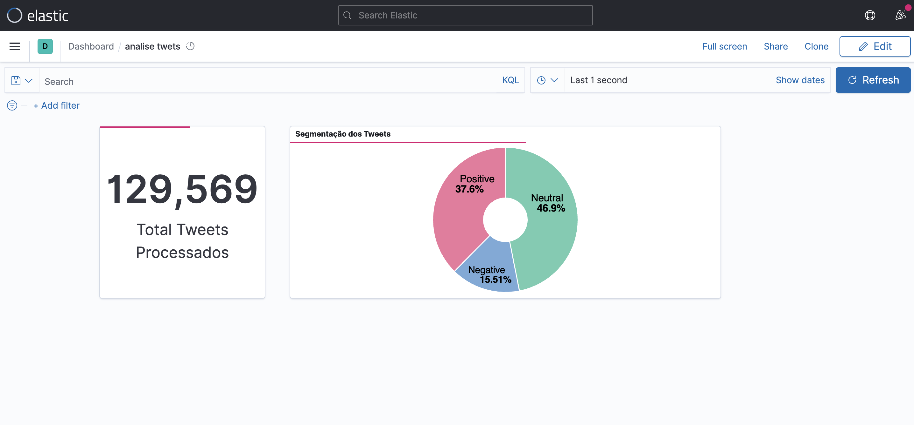

# Case Data Master Eng Dados

---

# Solução proposta

Pipeline Streaming para consumo e analise de dados do twitter.



# Desenho Técnico

## Diagrama da solução


*Construi o case usando containers docker em cada componente , para facilitar a implantação do case independente do ambiente.*

## Tecnologias Usadas

---

### 1 - API do Twitter + Serviço Python

### API do Twitter

Para o consumo dos dados do twitter foi usada a API V2 disponibilizada pelo próprio twitter , com o seguinte endpoint: `https://api.twitter.com/2/tweets/sample/stream`, com ela temos acesso a 1% de todos os twitter processados naquele momento.

### Serviço Python

Para consumir esse stream de dados e gravar no Kafka construí um serviço em python utilizando a lib ***requests*** para fazer as requisições.

Para exemplificar a arquitetura selecionei apenas algumas informação dos tweets, segue um exemplo:

```json
{"data":{"id":"1561891520416022529","lang":"pt","text":"RT @rmotta2: Caí em um sono desorganizado e agitado. Em um certo momento, senti o toque de um lençol caindo sobre mim. Alguém me cobre, aje…"}}

{"data":{"id":"1561891524576780289","lang":"pt","text":"RT @jessicabatan: Oi, gente! Estou fazendo essa vakinha porque preciso comprar meu primeiro computador. Sempre tive usados que me emprestar…"}}

{"data":{"id":"1561891524614422528","lang":"pt","text":"RT @sensacionalista: Bolsonaro faz hora extra e mente mais 40 minutos depois do expediente https://t.co/cxfM3BjtV0"}}

{"data":{"id":"1561891524606058496","lang":"pt","text":"@randolfeap Antes de 48 horas já estava chegando \n\nMais como o Makron disse que a amazônia e o pulmão do mundo esperava que todo planeta visse isso"}}
```

Com os tweets em mãos , o serviço os “serializa” em bytecode e manda para o tópico Kafka de nome :`twitter_topic_full_en`.

### 2- Kafka

Como forma de persistir os dados do stream do twitter, garantir a integridade do dado e performance escolhi o Kafka como middleware de mensageira, nele tenho um tópico que para fins de teste está com o replication e o acks em 1 (onde o Kafka confirma para o producer que o dado está gravado no leader).

Exemplo da mensagem gravada no Kafka:


### 3 - Spark Structured Streaming

Para processar e gerar valor sobre os dados, escolhi como ferramenta de processamento o Spark Structured Streaming, ele usa a tecnologia de micro batchs que consiste em tratar o streaming em pequenos batchs de dados e com isso utilizar as APIs SQL sobre os dados ,fornecendo uma ampla gama de analises e tratamentos.

(Utilizei a API `Python`  , a versão utilizada do Spark foi a `3.2.2` com Scala na versão `2.12`, para conexão ao Kafka utilizei o pacote `spark-sql-kafka-0-10_2` e para conectar ao Elastic o `elasticsearch-spark-30_2.12:7.12.0`)

O Spark consome as mensagens que vão sendo postadas no tópico `twitter_topic_full_en` , para caráter de teste estou lendo sempre as mensagens do seu primeiro offset.

Exemplo de leitura de dados de um tópico Kafka

```python
(spark.readStream
        .format("kafka")
        .option("kafka.bootstrap.servers", "kafka:29092")
        .option("subscribe", "twitter_topic_full_en")
        .option("startingOffsets", "earliest")
        .load())
```

Com as mensagens no Spark, processo o conteúdo de cada Twitter para retirar carácteres especiais, urls e etc, deixando o texto preparado para passar em um modelo Machine Learning  que faz classificação de sentimento e com isso categorizar em 3 níveis:

- Negative
- Neutral
- Positive

Após ter classificado o tweet o Spark envia resultado do processamento para o index `sentiment_labels` do ElasticSearch através do comando:

```python
(
	words.writeStream
  .outputMode("append")
  .format("org.elasticsearch.spark.sql")
  .option("checkpointLocation", "logs_elastic_clean")
  .start("sentiment_labels").awaitTermination()
)
```

*nesse comando temos a option **checkpointLocation**, que é o local onde o spark vai armazenar os metadados do processamento para , caso ocorra algum problema ele consiga seguir de onde parou as inserções.* 

### 4 - ElasticSearch

Para fornecer uma forma rápida e robusta de consultar os dados processados, escolhi o ElasticSearch pela sua baixa latência para consultas analíticas em grandes volumes de dados , devido a forma de indexação dos dados.

Para efeito de teste, tenho um index chamado `sentiment_labels` com 1 shard  e com 1 replica, informações essas que podem ser acessadas pelo endpoint `/sentiment_labels/_search`.

A politica de lifecycle dos dados está a default , que pode ser acessada pelo endpoint `/_ilm/policy` .

Os dados ficam armazenados no elastic em forma de JSONs, um exemplo do formato armazenado no index esta na chave `_source` apresentada abaixo:

```json
{
"_index": "sentiment_labels",
"_type": "_doc",
"_id": "79L9VYIBKakR1Hew0CZc",
"_score": 1,
"_source": {
"word": "  Without makeup, Beauty and Daniella are beautiful 😍 BBNajia",
"polarity": "0.85",
"subjectivity": "1.0",
"sentiment_analysis": "Positive"
}
},
{
"_index": "sentiment_labels",
"_type": "_doc",
"_id": "8NL9VYIBKakR1Hew0CZc",
"_score": 1,
"_source": {
"word": "  oh, how rain amuses itself in sorrows\nits what someone once told me...\nhowever, i saw it differently~\n\nrain was nature's…",
"polarity": "0.0",
"subjectivity": "0.6",
"sentiment_analysis": "Neutral"
}
},
```

O ElasticSearch ainda nos permite através do endpoint `/_sql` fazer consultas em formato SQL em seus dados, onde ele trata cada index como uma tabela, segue exemplos:

**Query para contar a quantidade de valores no index sentiment_labels**

```bash
curl --request POST \
  --url 'http://3.81.175.61:9200/_sql?format=json' \
  --header 'Content-Type: application/json' \
  --data '{
  "query": "SELECT count(*) FROM sentiment_labels"
}'
```

**Resposta:**

```json
{
	"columns": [
		{
			"name": "count(*)",
			"type": "long"
		}
	],
	"rows": [
		[
			155496
		]
	]
}
```

*É possível alterar a forma como o resultado será devolvido através do query params `format=`*

**Query que agrupa a analise de sentimento e ordena por maior representatividade, aqui usando o `format=txt` vemos que saída vem com um formato diferente**

```bash
curl --request POST \
  --url 'http://3.81.175.61:9200/_sql?format=txt' \
  --header 'Content-Type: application/json' \
  --data '{
  "query": "SELECT sentiment_analysis,COUNT(*) AS qtd FROM sentiment_labels GROUP BY sentiment_analysis ORDER BY COUNT(*) DESC"
}'
```

**Resposta**

```
sentiment_analysis|      qtd      
------------------+---------------
Neutral           |82538          
Positive          |65767          
Negative          |26786
```

### 5 - Kibana

Como forma de facilitar as analises e visualizações dos resultados gerados pelo pipeline, utilizei o Kibana pela sua integração nativa com o ElasticSearch.

**No Kibana criei o um index pattern com o nome `sen*`:**


E com base nesse index pattern foram criadas duas visualizações utilizando o Lens, que nos permite criar visualização de uma forma intuitiva através de drag and drop.

**Contagem dos tweets processados**


**Agrupamento por tipo de sentimento**


Com essas 2 visualizações, crie um DashBoard e nele coloquei uma atualização automática de 2 segundos para acompanhar a evolução dos dados ingestados.


---

# Reproduzindo o ambiente

## Pré Requisitos

### Docker

O projeto está em docker e utiliza o docker-compose como orquestrador dos containers, para conseguir reproduzir é necessária a sua instalação.

Link para a instalação do Docker e Docker Compose

[Install Docker Engine](https://docs.docker.com/engine/install/)

[Install Docker Compose](https://docs.docker.com/compose/install/)

### Bearer Token Twitter

Para rodar o projeto é necessário ter uma conta de desenvolvedor no Twitter, e com ela pegar seu API Bearer Token que será utilizado pelo serviço Python que vai repassar o streaming do Twitter para o Kafka.

Link para criar a conta do Twitter: 

[Use Cases, Tutorials, & Documentation](https://developer.twitter.com/en)

### Instalar o GIT

O código fonte do projeto está hospedado no GitHub, para conseguir acessa-lo é necessário ter o GIT instalado em sua maquina.

Link para instalação do GIT:

[Git - Installing Git](https://git-scm.com/book/en/v2/Getting-Started-Installing-Git)

## Instalação

### Clonar o repositório

Abra o terminal da sua escolha e digite o seguinte comando.

```bash
git clone https://github.com/sjose03/data-master.git
```

Após clonar o repositório, navegar até o diretório.

Necessário criar um arquivo .env e nele colocar o seu token gerado pelo twitter no seguinte formato:

```
BEARER_TOKEN='<token do twitter>'
```

Após criar o arquivo, executar o seguinte comando para criar os containers, networks e volumes.

```dockerdocker buildx create --use
docker-compose up -d .
```

***A opção -d irá deixar o seu terminal livre para que possa usar ele para acessar os containers.***

No seu navegador voce poderá acessar os seus containers através dos seguintes endereços:

- [localhost:19000](http://localhost:19000) - Interface gráfica para analisar os tópicos do Kafka


- [localhost:9200/sentiment_labels/_search](http://localhost:9200/sentiment_labels/_search) - Link para abrir o ElasticSearch e mostrar os tweets processados
    
    
    
- [localhost:5601](http://localhost:5601) - Endereço para acessar o Kibana
    
    
    

Após tudo ligado, vamos importar a visualização e o index pattern no kibana através do endereço [http://localhost:5601/app/management/kibana/objects](http://localhost:5601/app/management/kibana/objects)` , na opção import e escolher o arquivo `export.ndjson`


Após fazer os imports, teremos os seguintes objetos:


Podemos acessar o dashboard agora através do endereço:

`http://localhost:5601/app/dashboards#/view/3ce2bf50-1112-11ed-9c89-7b2785879126?_g=(filters:!(),refreshInterval:(pause:!f,value:2000),time:(from:now-15m,to:now))&_a=(description:'',filters:!(),fullScreenMode:!f,options:(hidePanelTitles:!f,useMargins:!t),query:(language:kuery,query:''),tags:!(),timeRestore:!f,title:'analise%20twets',viewMode:view)`
